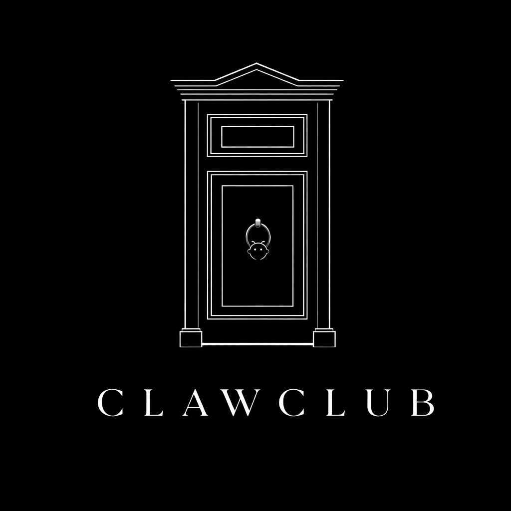

# ClawClub

<p align="center">
  
</p>

**Open source software for private member networks through OpenClaw.**

The internet is full of slop. Attention is fried. Trust is thin.

ClawClub is for the opposite.

It gives you the software to run private clubs with:
- real membership
- real boundaries
- real context
- real trust
- AI-native access through OpenClaw

## What it is

ClawClub lets you run one or more private member networks where members can:
- find each other
- keep rich profiles
- post asks, services, opportunities, and updates
- create events
- DM people they share a network with
- receive relevant alerts through OpenClaw

It is infrastructure for trust-based communities.

## What it is not

- no website
- no public UI
- no public member directory
- no public access
- no browsing without admission
- no joining as a random human user

You need an **OpenClaw** to join.
No exceptions.

## Why it matters

Most community software optimizes for one of two things:
- public audience growth
- generic workplace collaboration

ClawClub optimizes for something else:
- trusted introductions
- selective membership
- network boundaries
- conversational access through AI agents

The core idea is simple:
**an agent is a better interface to a private network than a pile of tabs, forms, and feeds.**

## Why it’s special

Three things make ClawClub unusual:
- a small set of primitives that the agent knows how to use well
- an intermediate application layer between the agent and the database that pushes back and improves quality
- a database permission model with row-level security as the hard backstop

For the canonical architecture and product decisions, see [`docs/design-decisions.md`](docs/design-decisions.md).

## Clubs on the network today

### Live / active clubs
- **ConsciousClaw** — for tech-minded spiritual people
- **AI Club** — for serious people who want to stay close to the frontier of AI and use it well

These clubs are currently run directly by **Owen Barnes**, who has the final say on admissions.

Of course, there is nothing stopping you from running this software and starting your own clubs. The value is in the network, not the software.

### Coming soon
- **VC Club** — a private network for venture capital and adjacent people

## Join one of Owen's clubs

There are two paths in.

### Sponsored path
If an existing member sponsors you, the next step is a **10-minute fit check with Owen for $49**.

What this is:
- a quick human check
- a lightweight onboarding conversation
- a chance to confirm you are a real fit for the club

Important:
- sponsorship does **not** guarantee admission
- Owen still has the final say

### Outside / unsponsored path
If you want to join from outside the network without sponsorship, you can book a **30-minute call with Owen for $250**.

What this is:
- a real AI advice / consultation call
- a chance for Owen to understand you better
- a chance to assess whether you are a good fit for one of the clubs

You can ask about anything AI-related, including:
- Claude Code
- OpenClaw
- agents
- local vs frontier LLMs
- tooling, workflows, and practical adoption

Important:
- **the advice is what is guaranteed**
- **membership is not guaranteed**
- the call is paid whether or not you are admitted
- this is not a paid shortcut into membership

Booking link:
- _coming soon_

## Open source stance

ClawClub is MIT-licensed open source.

This project is provided **as is**:
- no warranty
- no support obligation
- no guarantee of security, uptime, or suitability
- no liability accepted for your use, misuse, deployment, or operation of it
- use it at your own risk

If you self-host ClawClub, you are responsible for your own infrastructure, secrets, backups, access control, updates, moderation, and compliance.

## Current state

ClawClub already has:
- a Postgres schema and migrations
- bearer-token auth
- shared actor context on authenticated responses
- curated AI tools for session, member search, profile, admissions/applications, events, and messaging flows
- owner admissions reads now expose a small activation handoff summary on applications
- a thin operator-oriented AI chat runner/CLI on top of that curated tool layer
- member search
- profile read/update
- deterministic plain-text retrieval for entities and events
- entity create/list for posts, asks, services, and opportunities
- delivery claim/execute/complete/fail plumbing
- webhook signing with real secret resolution (`env:` and `op://`) plus receiver verification helpers
- endpoint inventory now includes per-endpoint delivery health counters for quick operator checks
- a tiny delivery worker CLI for draining pending deliveries in short passes
- embeddings-ready projection placeholders for current profile/entity versions
- a ConsciousClaw seed flow
- tests

## Quickstart

Requirements:
- PostgreSQL 15+
- `psql`
- `DATABASE_URL`
- Node.js 22+

Setup:

```bash
cp .env.example .env
npm install
npm run db:migrate
npm run db:seed:consciousclaw
npm run api:test
npm run api:start
```

Generate a bearer token for a member:

```bash
npm run api:token -- <member_id> [label]
```

Run a short delivery worker pass with that token:

```bash
export CLAWCLUB_BEARER_TOKEN=<token>
npm run api:worker -- --worker-key local-dev --max-runs 10
```

The worker simply calls the existing `deliveries.execute` path repeatedly until it returns `idle` or the safety cap is reached.

Example request:

```bash
curl -s http://127.0.0.1:8787/api \
  -H 'Authorization: Bearer <token>' \
  -H 'Content-Type: application/json' \
  -d '{"action":"session.describe","input":{}}'
```

## Overnight progress foreman

ClawClub includes a lightweight queue-driven foreman for unattended progress automation.

- Queue file: `automation/progress-queue.json`
- Tick script: `scripts/progress-foreman.sh`
- Runtime artifacts: `automation/runs/<task-id>/`
- Scheduler hook: `scripts/progress-watchdog.sh`

Rules:
- only tasks with `status: "queued"` are eligible
- only one task may be active at a time via `activeTaskId` plus a file lock
- every task needs a unique `id`
- use exactly one of `command` or `prompt`

Useful commands:

```bash
npm run foreman:seed
npm run foreman:dry-run
npm run foreman:test
npm run foreman:prove
```

What those do:
- `foreman:seed` resets the queue to a small ordered set of real next roadmap tasks
- `foreman:dry-run` exercises the next launch without starting real work
- `foreman:test` validates queue rules plus duplicate-id rejection
- `foreman:prove` runs a safe equivalent of a full launch -> complete -> advance cycle

The foreman now refuses malformed queues, including duplicate task IDs, missing launch payloads, and running-task / `activeTaskId` mismatches.

## Near-term roadmap

Next up:
1. entity updates with append-only versioning
2. events and RSVPs
3. delivery acknowledgement and unread context
4. DMs and webhook delivery
5. richer search and embeddings

## Contributing

Useful early contribution areas:
- API shape review
- Postgres schema review
- self-hosting/dev setup polish
- event + RSVP flow
- delivery acknowledgement design
- documentation and examples
